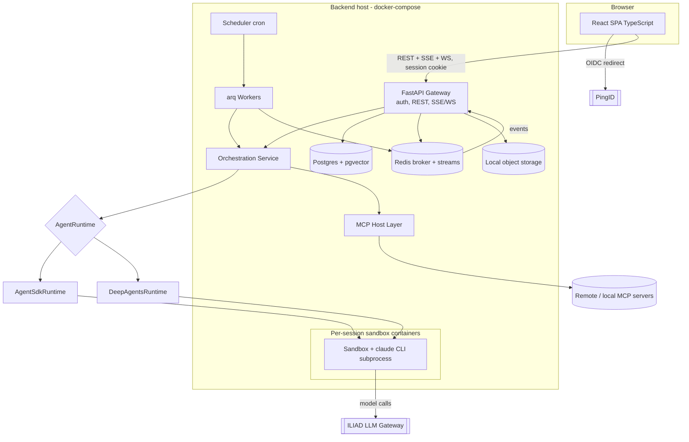

# Multi-User Web Claude Desktop / Cowork Backbone — Product Requirements Document & Technical Design

*Version 1.0 · Prepared for a senior engineering owner · Target runtime: local docker-compose · Model access: enterprise gateway "ILIAD" · Orchestration: Anthropic Claude Agent SDK (Python) with LangChain Deep Agents fallback · Single-org SSO via PingID*

> Implementation status against this document is tracked in [ARCHITECTURE.md](ARCHITECTURE.md); decisions in [adrs/](adrs/).

---

## TL;DR

- **Build it as a FastAPI + React (TypeScript) system whose orchestration core is the Claude Agent SDK (Python), with every model call routed through ILIAD by setting `ANTHROPIC_BASE_URL`/`ANTHROPIC_AUTH_TOKEN` on the SDK's subprocess — and put an `AgentRuntime` interface in front of it from day one so that swapping to LangChain Deep Agents (LangGraph) is a one-adapter change, not a rewrite.** The single hardest architectural fact to internalize: the Agent SDK spawns one `claude` CLI subprocess per session (owning a shell, working directory, and JSONL transcript on local disk), so a multi-user web app must treat each session as a resource-bounded process (~1 GiB RAM / 1 CPU / 5 GiB disk to start) inside a per-session sandbox container.
- **The two biggest risks are both about contracts you don't yet control.** (1) ILIAD's API shape is unknown; the whole design hinges on whether ILIAD exposes the **Anthropic Messages API** with streaming, tool use, extended thinking, and prompt caching, and whether it accepts the auth header/beta headers the SDK sends. Gate the whole project on a Phase-1 spike with explicit pass/fail criteria, and keep the Deep Agents fallback warm. (2) Remote-MCP OAuth: the Agent SDK does **not** run an interactive OAuth flow — your app must complete OAuth 2.1 + PKCE itself, store the per-user token encrypted, and inject `Authorization: Bearer …` into the MCP server's `headers`.
- **You are re-implementing, not wrapping, Claude Cowork** (which went GA April 9, 2026 and is on by default for Pro/Max/Team/Enterprise). Because you control the backend you can *fix Cowork's known gaps*: Cowork activity is explicitly excluded from Anthropic's Audit Logs, Compliance API, and Data Exports on every plan tier including Enterprise — your design makes DB-stored, tamper-evident audit logging of every privileged action a P0 requirement. Parity target = Chat + Projects + Artifacts + Memory + MCP connectors + sandboxed agentic workspaces + long-running/scheduled tasks + skills + plugins + sub-agents + team sharing + search.

---

## Key Findings

1. **Claude Cowork is the reference product and it is built on the Agent SDK.** Cowork entered macOS public beta in January 2026, hit Windows in February, and went generally available on April 9, 2026; it is included with all paid plans and, per Claude Academy, "is generally available on the Pro, Max, Team, and Enterprise plans, where it's on by default" and "isn't available on the Free plan." It runs in "a secure sandbox environment, accesses only folders you have explicitly allowed," delivers finished deliverables (xlsx/pptx/docx) to the filesystem, parallelizes work across sub-agents, exposes three permission modes (Manual / Auto / Skip) with always-on deletion protection, and persists sessions server-side so work continues when the laptop closes. Anthropic sampled 1.2 million anonymized Claude Cowork sessions from May 11–31, 2026 across more than 600,000 organizations; software development was just 8.7% of usage, with business process/operations leading at 33.4% and content creation/copywriting at 16.4% — i.e., the backbone must be tuned for general knowledge work, not just coding.

2. **The Agent SDK's runtime model dictates the whole hosting design.** Per Anthropic's "Hosting the Agent SDK" docs: "When your code calls `query()`, the SDK spawns a separate `claude` CLI process and talks to it over stdio. That subprocess owns the shell, the working directory, and the JSONL session transcripts on local disk. One agent session maps to one subprocess." Recommended starting allocation is "1 GiB RAM, 5 GiB disk, and 1 CPU per agent." For multi-tenant isolation inside a shared container, pass `setting_sources=[]` (Python) to skip user/project/local settings and set `CLAUDE_CODE_DISABLE_AUTO_MEMORY=1`. Anthropic also notes that, unless previously approved, third-party developers may not offer claude.ai login/rate-limits for products built on the SDK — you must use API-key-style auth, which for us means the ILIAD token.

3. **Routing the SDK through ILIAD is a solved pattern *if* ILIAD speaks Anthropic's protocol.** The SDK honors the standard `ANTHROPIC_BASE_URL`; when set, "the SDK uses that URL as the root for every API call instead of `https://api.anthropic.com`. The request format, auth header, and streaming protocol all stay the same." Gateway auth typically uses `ANTHROPIC_AUTH_TOKEN`, and custom headers can be injected with `ANTHROPIC_CUSTOM_HEADERS`. Caveat from the field: there is "no silent fallback to the public Anthropic endpoint," and there is "no model-name translation" — if ILIAD expects a specific model ID, requests with a mismatched name fail. Bedrock/Vertex-style provider switches exist but the cleanest path is ILIAD exposing `/v1/messages`.

4. **Deep Agents is a credible, architecturally-similar fallback.** `deepagents` (LangGraph-based, `create_deep_agent`) ships built-in `write_todos`, filesystem tools, an `execute` shell tool (only if the backend supports `SandboxBackendProtocol`), and a `task` tool for subagents with isolated context. It uses composable middleware, LangGraph interrupts for human-in-the-loop (`interrupt_on={"edit_file": True}`), checkpointers for durable execution, and pluggable filesystem backends. Its security posture is explicit: "Deep Agents follows a 'trust the LLM' model… Enforce boundaries at the tool/sandbox level, not by expecting the model to self-police."

5. **MCP is now an enterprise-grade standard, and your web app is an MCP *host* acting for many users.** The 2025-06-18 revision made OAuth 2.1 the baseline (Authorization Code + PKCE), classified the MCP server as an OAuth resource server, mandated RFC 8707 resource indicators and RFC 9728 protected-resource metadata, and made Streamable HTTP the canonical remote transport. Critically: "The SDK doesn't open a browser or run an interactive OAuth flow… To supply credentials, complete the OAuth flow in your own application and pass the resulting access token in the server's headers."

6. **Sandboxing consensus (2026): shared-kernel runc is not enough for untrusted agent code.** Anthropic's own "Securely deploying AI agents" doc shows a hardened container baseline (`--cap-drop ALL --security-opt no-new-privileges --security-opt seccomp=… --read-only --tmpfs …`) and notes "if you need kernel-level isolation, use gVisor or a separate VM." Cowork itself uses `@anthropic-ai/sandbox-runtime` (bubblewrap + proxy-based network filtering). Our local v1 uses hardened Docker + egress-allowlist proxy, architected to upgrade to gVisor/Kata/Firecracker.

7. **SSE is the right default for the event stream; durable sessions solve reload survival.** Workers push progress to Redis while an SSE endpoint streams to React; WebSockets are reserved for bidirectional needs (tool-approval prompts, live steering). "Durable sessions" (offset-based resumable streams, server-side session state that outlives any one connection) are what make a 5-minute agent task that drops at minute 4 resume at minute 4.

---

## Details

### 1. Executive Summary & Product Vision

**What it is.** A multi-user web application for a single enterprise organization that reproduces the Claude Desktop + Cowork experience — multi-turn streaming chat, projects, artifacts, memory, MCP connectors, sandboxed agentic execution over workspace folders, long-running and scheduled tasks, skills, plugins, and sub-agents — and is engineered as a reusable **backbone** on which the org can build many Cowork-style agentic knowledge-work applications.

**Who it's for.** Internal enterprise users behind PingID SSO; team leads and admins who govern access; security/compliance auditors who need immutable logs; and developers who build cowork-like projects on top of the backbone using its extension points (custom tools, skills, plugins, UI slots).

**Relationship to Cowork-style products built on top.** The backbone owns identity, tenancy, orchestration, MCP hosting, sandboxing, persistence, streaming, audit, and cost accounting. A "cowork project" is a thin composition on top: a bundle of skills + custom tools + an approved MCP connector set + a system-prompt/instruction pack + optional UI slots.

**Positioning decision.** Build a re-implementation, not a thin wrapper of the hosted product. DB-stored, tamper-evident audit logging is therefore a headline feature of the backbone, not an afterthought.

### 2. Goals, Non-Goals, Success Metrics, Assumptions, Constraints

**Goals (P0 unless noted).** Feature parity per §4; production hardening aligned to OWASP ASVS; all application logs, audit events, and LLM request/response logs (with token/cost accounting) stored in Postgres with admin/auditor access; pluggable orchestration (`AgentRuntime`) and model-provider (`ModelProvider`) layers; local-first runtime (docker-compose) that lifts to Kubernetes without redesign.

**Non-goals (v1).** Cloud/K8s deployment; multi-tenant SaaS; native mobile apps; non-Anthropic model families beyond what ILIAD exposes; on-device local models.

**Success metrics.** TTFT < 2 s p50, < 5 s p95; agent-run resumability across page reload = 100%; privileged-action audit coverage = 100%; sandbox escape incidents = 0, egress limited to allowlist; ILIAD compatibility decision reached by end of Phase 1.

**Assumptions & constraints.** ILIAD contract is unknown (top risk); Agent SDK = subprocess-per-session; single machine under docker-compose; PingID supports OIDC discovery + JWKS.

### 3. Personas & Roles

| Persona | Needs | App role |
|---|---|---|
| End user | Chat, run agents on their workspaces, attach their connectors | `user` |
| Team lead | Share projects, see team usage, manage team membership | `team_lead` |
| Workspace admin | Create/allocate workspaces, set quotas, approve connectors for a team | `workspace_admin` |
| Org admin | Manage org-wide connector catalog, capability kill-switches, RBAC, retention | `org_admin` |
| Security/compliance auditor | Read-only, immutable access to audit/LLM/app logs; export | `auditor` |
| Backbone developer | Register custom tools/skills/plugins, define cowork-project bundles, UI slots | `developer` |

### 4. Feature Requirements & Parity Matrix

| Feature | Web v1 requirement | Priority |
|---|---|---|
| Multi-turn streaming chat | SSE token/event stream, resumable via offsets; WS only for approvals/steering | P0 |
| Projects | `Project` entity: files, instructions, memory scope, member sharing | P0 |
| Artifacts | Sandboxed `srcdoc` iframe render + versioning; Live Artifacts | P0 (Live P1) |
| Memory | pgvector memories scoped per user/project; opt-out per project | P1 |
| MCP connectors | Per-user OAuth, org-approved catalog, allowlists | P0 |
| Agentic workspace | Per-session container workspace bound to a Workspace entity | P0 |
| Long-running tasks | Worker + durable session; survive reload | P0 |
| Scheduled tasks | Cron scheduler; each run = isolated agent session; per-task permission mode | P1 |
| Skills | Skill registry; on-demand load into agent context | P1 |
| Plugins | Plugin registry, org/team scoping | P2 |
| Sub-agents | `Agent`/`task` tool; concurrency-limited | P1 |
| Permissions/approvals | Approval model + `canUseTool` + hooks; deletion always prompts | P0 |
| Sharing & teams | Team-scoped sharing of conversations/projects/workspaces | P1 |
| Search | pgvector semantic + Postgres full-text | P1 |
| Admin console | Catalog, quotas, kill-switches, RBAC | P1 |
| Audit/log viewer | DB audit viewer with immutable, access-controlled records | P0 |
| Usage & cost | Per-user/team/project cost from `total_cost_usd`/`usage` | P1 |

**Acceptance criteria (one per P0 area).**
- *Chat/streaming:* Given an in-progress run, when the browser reloads, then the client reconnects and receives all events from the last acknowledged offset with no duplicates and no restart of model work.
- *Projects:* Given a project with instructions + 3 files, when a chat is started in it, then the agent context includes the instructions and files are available to the workspace, and this is recorded in the run's context manifest.
- *MCP connectors:* Given a user who has not authorized connector X, when they invoke a tool from X, then the run continues without X's tools, the connector shows `needs-auth`, and the UI prompts the user to complete OAuth; after OAuth, the token is stored encrypted and injected as a Bearer header on subsequent runs.
- *Agentic workspace:* Given a task scoped to Workspace W, when the agent attempts to write outside W's mounted path, then the sandbox denies it and a `tool_denied` audit event is written.
- *Approvals:* Given a delete operation in any permission mode, when the agent requests it, then a human approval is required before execution and the decision is audit-logged.
- *Audit:* Given any privileged tool call, when it executes, then an append-only, hash-chained `audit_events` row is written atomically with the operation.

### 5. User Journeys & Key Flows

1. **Login via PingID** — OIDC Authorization Code + PKCE via a backend-for-frontend; HttpOnly session cookie; group claims mapped to roles; `session.start` audit event.
2. **Start streaming chat** — `POST /v1/conversations/{id}/messages` enqueues a run; worker starts the runtime with `ANTHROPIC_BASE_URL`=ILIAD; events to Redis; `GET /v1/runs/{id}/events` streams with offsets.
3. **Attach connector via OAuth** — catalog → `POST /v1/connectors/{id}/authorize` → OAuth 2.1 + PKCE server-side → encrypted token → `connected`.
4. **Agentic task with approvals** — Workspace-scoped run; `canUseTool`/PreToolUse gate mutating tools; approvals over SSE/WS; every decision audit-logged.
5. **Schedule a recurring task** — cadence + prompt + permission mode; each fire is an isolated run/session.
6. **Share a project with a team** — ACL rows; members see files and optionally memory scope.
7. **Admin reviews audit log** — filterable viewer; hash-chain verification endpoint.

### 6. High-Level Architecture

**Trust boundaries.** Browser ↔ API (TLS + HttpOnly cookie + CSRF); API ↔ worker (internal network); sandbox (untrusted code, egress via allowlist proxy only, workspace-only mounts); ILIAD (sole LLM egress); MCP servers (per-user least-privilege tokens, org-approved catalog only).

### 7. Low-Level Architecture

#### 7.1 Orchestration adapter (`AgentRuntime`)
See `backend/app/orchestration/base.py`. `AgentSdkRuntime` uses `ClaudeSDKClient` per run with `can_use_tool`, PreToolUse/PostToolUse hooks, in-process MCP servers, `AgentDefinition` sub-agents, `max_budget_usd`, `task_budget`, `setting_sources=[]`, `CLAUDE_CODE_DISABLE_AUTO_MEMORY=1`. Permission evaluation order: PreToolUse Hook → Deny rules → Allow rules → Ask rules → Permission Mode → `canUseTool` → PostToolUse. `bypassPermissions` is never used for user-facing runs. `DeepAgentsRuntime` maps the same `RunConfig` onto `create_deep_agent` with `interrupt_on` and a checkpointer.

#### 7.2 Model-provider abstraction (ILIAD boundary)
`ModelProvider.env()` → `{ANTHROPIC_BASE_URL, ANTHROPIC_AUTH_TOKEN, ANTHROPIC_CUSTOM_HEADERS, [CLAUDE_CODE_DISABLE_EXPERIMENTAL_BETAS=1], [NODE_EXTRA_CA_CERTS]}`; `Capabilities` records the spike result. Fallback: `IliadOpenAICompatProvider` (LiteLLM) feeding Deep Agents.

#### 7.3 MCP host design
`mcp_servers` is a dict of `McpServerConfig` (stdio / http / sse / sdk). The host maintains the org-approved catalog, runs OAuth 2.1 + PKCE itself (DCR, RFC 8707 `resource`, RFC 9728 discovery), stores tokens with envelope encryption, injects `Authorization: Bearer` at run start, surfaces `connected | failed | needs-auth | pending | disabled`, enforces `mcp__<server>__<tool>` allowlisting, and implements an elicitation UI (form + URL). Local stdio servers run inside the sandbox behind an org toggle.

#### 7.4 Sandbox runner
One hardened container per active run (cap-drop ALL, no-new-privileges, seccomp, read-only root + tmpfs, non-root, ~1 CPU / 1 GiB / 5 GiB, workspace-only mount, default-deny egress via allowlist proxy with ILIAD always allowed). Runner interface is container-runtime-agnostic (gVisor/Kata/Firecracker upgrade path). Deletion always requires human approval.

#### 7.5 Event streaming
SSE by default (`GET /v1/runs/{id}/events`), WS for approval/steering. Every event has a monotonic `seq`; events are persisted so `Last-Event-ID` resumes with no duplicates and no model rework. Event schema: `{"run_id","seq","type","data","ts"}`.

#### 7.6 Background tasks & scheduler
arq + Redis; Postgres holds durable run/task state; cron-like schedules where each fire is an isolated agent session with the task's saved prompt, permission mode, connectors, skills, plugins.

#### 7.7 Memory, artifacts, files, caching
pgvector (HNSW, cosine) embeddings scoped per user/project, background embedding worker, per-project opt-out; artifacts in a sandboxed `srcdoc` iframe (`sandbox="allow-scripts"`, never with `allow-same-origin`) with a dedicated preview CSP and CDN allowlist, versions, ≤20 MB; docx/pptx/xlsx/pdf generation in the sandbox; uploads type/size validated; prompt caching via ILIAD if supported; concurrency limits and cost quotas.

### 8. Data Model & Schemas
Implemented in `backend/app/models/` and `backend/app/migrations/versions/0001_initial.py` (users, roles, user_roles, teams, memberships, workspaces, projects, project_files, project_shares, conversations, messages, content_blocks, tool_calls, tool_results, artifacts, artifact_versions, attachments, connectors, connector_credentials, oauth_states, agent_sessions, runs, run_events, approvals, elicitations, tasks, schedules, skills, plugins, memories, embeddings, usage_records, capability_flags, project_bundles). Log tables `audit_events`, `llm_request_logs`, `app_logs` are RANGE-partitioned monthly, append-only (REVOKE + trigger), and `audit_events` is HMAC-SHA256 hash-chained per partition stream. Retention: app_logs 30–90 d; llm_request_logs 90–365 d; audit_events ≥ 365 d. Content-block JSON mirrors Anthropic blocks.

### 9. API Surface
Auth `/v1/auth/{login,callback,logout,dev-login}`, `/v1/users/me`; CRUD `/v1/teams`, `/v1/workspaces`, `/v1/projects` (+`/files`, `/shares`); `/v1/conversations` (+`/messages` starts a run), `/v1/runs/{id}` (+`/events` SSE, `/interrupt`, `/approvals`, `/elicitations`, `/ws`); `/v1/tasks` (+`/run`, `/runs`), `/v1/schedules`; `/v1/connectors` (+`/{id}/authorize`, `/oauth/callback`, `/{id}/credentials`); `/v1/files`, `/v1/artifacts` (+`/versions`, `/render`, `/refresh`); `/v1/skills` (+`/import`), `/v1/plugins`, `/v1/memory`, `/v1/search`, `/v1/bundles`; admin `/v1/admin/{audit,audit/verify,audit/export,llm-logs,app-logs,usage,runs,capabilities,connectors,roles,users/{id}/roles,users/{id}/status}`. Cross-cutting: RFC 9457 `application/problem+json`, cursor pagination, `/v1` prefix, CSRF header on mutating calls, `X-Request-Id` propagation.

### 10. Security & Production Hardening
STRIDE mitigations: OIDC + JWKS, HttpOnly/Secure/SameSite cookie, no tokens in localStorage; append-only hash-chained audit; atomic audit rows; per-user data isolation in the query layer; envelope-encrypted connector tokens; sandbox egress allowlist; per-user run concurrency + cost quotas; rate limiting; least-privilege MCP tokens; deny rules; `bypassPermissions` forbidden; sandbox capability drop + seccomp + no-new-privileges. PingID via BFF with PKCE, `state`, `nonce`, discovery + JWKS (introspection if opaque). RBAC matrix as in §3. Prompt-injection defenses: action screening, tool-result sanitization, PreToolUse secret-path blocks, human approval for irreversible actions, deletion always prompts. Secrets via envelope encryption and a secrets manager. Supply chain: org-approved catalog only, pinned versions. Kill-switches: connectors, web tools, sandbox execution, plugins, new runs (drain), per-run interrupt.

### 11. Observability
Structured JSON logs to stdout and `app_logs` with `request_id` propagation; per-run metrics (TTFT, approval latency, run counts, HTTP latency) at `/metrics`; `/healthz`, `/readyz` (Postgres/Redis/ILIAD/sandbox).

### 12. Repository / File Structure
See the root README.

### 13. Local Runtime & Dev Experience
docker-compose services: postgres (pgvector), redis, backend, worker, scheduler, mock-iliad, frontend, optional sandbox image + egress proxy, optional litellm. Env vars documented in `config/.env.example`. Seed data: roles, demo team, demo users, approved in-process connectors, one mock remote OAuth MCP, one gated stdio MCP, one org skill, one plugin, one bundle. Migrations: Alembic on backend start. Tests: unit + integration (sqlite or Postgres, mocked runtime), mock ILIAD tests, Playwright e2e. Extension points: custom tools (`@backbone_tool` → in-process MCP), skills, plugins, UI slots, project bundles.

### 14. Phased Build Plan / Roadmap
Phase 0 walking skeleton → Phase 1 ILIAD spike + real chat (Decision Gate A: `scripts/iliad_spike.py`) → Phase 2 workspaces + sandbox → Phase 3 MCP connectors → Phase 4 tasks/schedules/subagents → Phase 5 skills/plugins/memory/search/artifacts → Phase 6 admin/hardening/parity. This repository delivers the code for all phases against a mocked ILIAD; Gate A remains to be executed against the real gateway.

### 15. Risks & Open Questions
Risks: ILIAD contract unknown; subprocess-per-session scaling; remote-MCP OAuth is ours; elicitation may be TS/CLI-only in the Python SDK; egress proxy does not inspect TLS; Cowork gaps must be built. Question lists: `docs/questions-iliad.md`, `docs/questions-pingid.md`.

### 16. Appendices
Glossary: *AgentRuntime* (orchestration abstraction), *ILIAD* (enterprise LLM gateway), *MCP host* (our app as MCP client for many users), *Durable session* (server-side, offset-resumable run), *Live Artifact* (artifact that refreshes from connectors/tools). Example SKILL.md, MCP configs and event/audit records are exercised by the seed data and tests.
